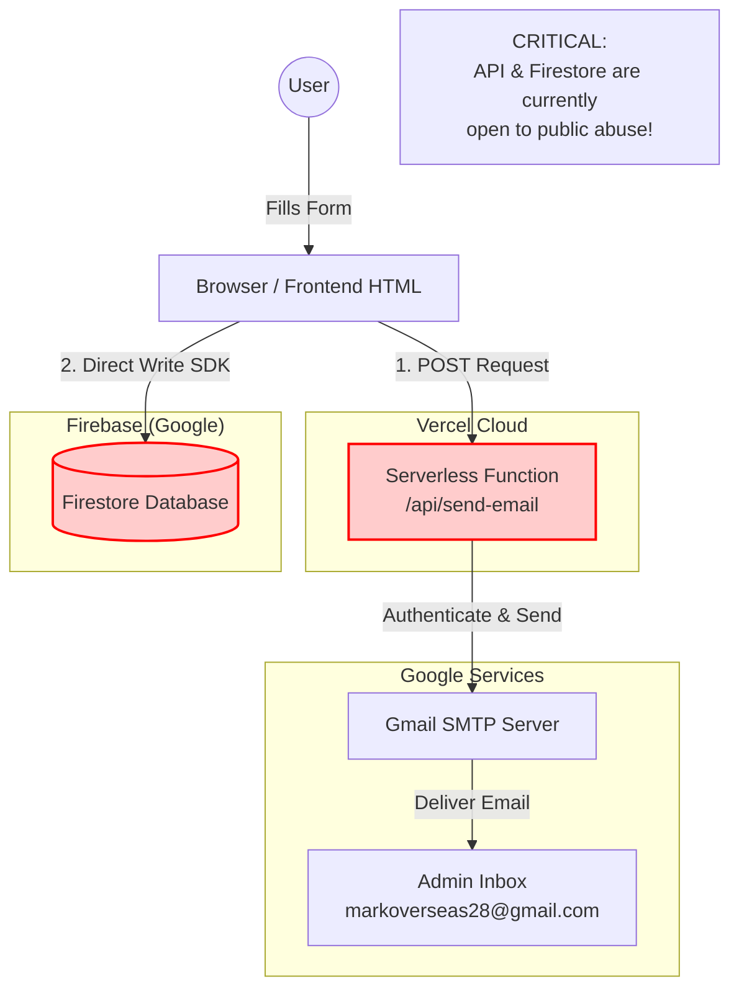

# System Architecture

## Security & Flow Analysis

1.  **Frontend (Browser)**:
    *   User fills out the contact form.
    *   The browser initiates two parallel actions:
        *   **Direct Write**: Uses the Firebase SDK to write data directly to the Firestore database.
        *   **API Call**: Sends a POST request to `/api/send-email` on Vercel.

2.  **Vercel Serverless Function (`/api/send-email`)**:
    *   Receives the request.
    *   Validates the origin (Fixed).
    *   Uses **Nodemailer** to connect to Gmail's SMTP server using secure environment variables (Fixed).
    *   Sends the email.

3.  **Firebase Firestore**:
    *   Receives the data directly from the frontend.
    *   Stores the inquiry for backup/admin dashboard purposes.

4.  **Gmail SMTP**:
    *   Authenticates the sender.
    *   Delivers the email to the admin inbox.
